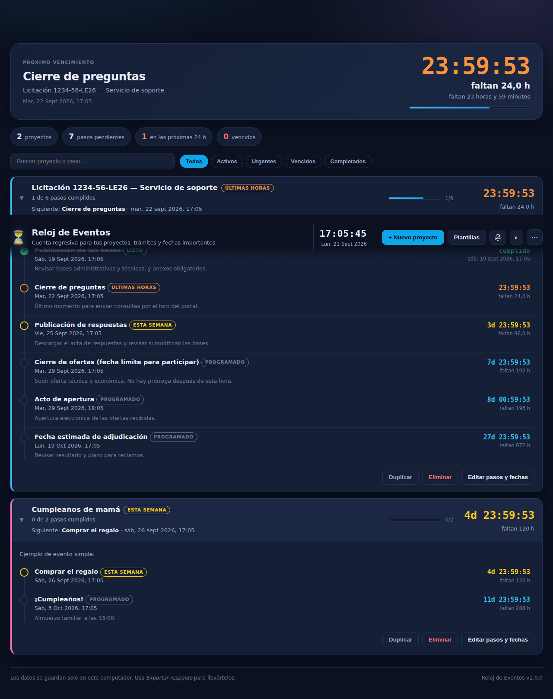

# ⏳ Reloj de Eventos

Aplicación de escritorio que muestra **cuántas horas faltan** para tus fechas importantes.
No es una sola cuenta regresiva: cada proyecto puede tener **varios pasos consecutivos**, cada uno
con su nombre, su descripción y su fecha/hora.

Pensado para casos como una **licitación de Mercado Público**, donde no hay una sola fecha sino una
secuencia: publicación → cierre de preguntas → publicación de respuestas → **cierre de ofertas** →
apertura → adjudicación. También sirve para un cumpleaños, un trámite o la entrega de un proyecto.



## Qué hace

- **Cuenta regresiva en vivo**, actualizada cada segundo: `7d 23:59:53` y también las **horas totales** (`faltan 192 h`).
- **Varios pasos por proyecto**, cada uno con nombre, descripción y fecha/hora. Se ordenan solos cronológicamente.
- **Reloj destacado** arriba con el vencimiento más próximo de todos tus proyectos.
- **Semáforo de estados**: Programado · Esta semana · Últimas horas (menos de 24 h) · Vencido · Listo.
- **Marcar pasos cumplidos** con un clic; el reloj salta automáticamente al siguiente paso.
- **Plantillas** listas: Licitación Mercado Público, Cumpleaños, Trámite o postulación, Entrega de proyecto.
  Eliges la fecha de inicio y los pasos se acomodan solos.
- **Avisos de escritorio** 24 h antes, 1 h antes y al vencer cada paso (botón de la campana).
- **Buscador y filtros** (activos, urgentes, vencidos, completados), duplicar proyectos, tema claro/oscuro.
- **Respaldo**: exporta todo a un archivo `.json` y vuelve a importarlo en otro computador.
- Funciona **sin internet**. Los datos se guardan solo en tu computador.

## Cómo usarla

### Opción 1 — Probarla al toque (sin instalar nada)

Abre `src/index.html` con doble clic. Se ve y funciona igual, dentro del navegador.

### Opción 2 — Como app de escritorio (ventana propia, avisos del sistema)

Necesitas [Node.js](https://nodejs.org) instalado.

```bash
cd reloj-eventos
npm install
npm start
```

### Opción 3 — Generar el instalador

```bash
npm run dist:win     # Windows: instalador .exe y versión portable
npm run dist:mac     # macOS: .dmg
npm run dist:linux   # Linux: .AppImage
```

El resultado queda en la carpeta `dist/`. Cada instalador se genera en su propio sistema operativo
(el de Windows se construye desde Windows, etc.).

## Cómo se usa el día a día

1. **+ Nuevo proyecto** (o `Ctrl/Cmd + N`) y le pones nombre: *"Licitación 1234-56-LE26 — Municipalidad de…"*.
2. Agregas un paso por cada fecha que tienes que cuidar, con **+ Agregar paso**. Cada paso lleva nombre,
   fecha/hora y una descripción opcional (por ejemplo: *"Subir oferta técnica y económica. No hay prórroga"*).
3. Guardas. La tarjeta muestra el paso siguiente y el tiempo que falta.
4. Cuando cumples un paso, haces clic en su círculo: queda tachado y el reloj pasa al siguiente.
5. Con la **campana** activas los avisos para que te avise aunque estés en otra cosa.

Para una licitación conviene partir desde **Plantillas → Licitación Mercado Público**: crea los seis
pasos típicos y después ajustas las fechas reales de las bases.

## Atajos

| Atajo | Qué hace |
|---|---|
| `Ctrl/Cmd + N` | Nuevo proyecto |
| `Ctrl/Cmd + E` | Exportar respaldo |
| `Esc` | Cerrar la ventana abierta |

## Dónde quedan los datos

En el almacenamiento local de la aplicación (`localStorage`), en tu propio computador. No hay servidor,
no hay cuenta y nada se sube a internet. Si vas a formatear o cambiarte de equipo, usa
**⋯ → Exportar respaldo** y luego **Importar respaldo** en el otro computador.

## Estructura del código

```
reloj-eventos/
├── src/
│   ├── index.html      estructura de la interfaz
│   ├── styles.css      estilos (tema oscuro y claro)
│   ├── core.js         lógica pura: cuentas regresivas, estados, plantillas, avisos
│   └── app.js          interfaz: dibujado, formulario, respaldo, eventos
├── electron/
│   ├── main.js         ventana de escritorio, menú en español
│   └── preload.js      puente mínimo y seguro con la interfaz
├── test/
│   └── core.test.js    pruebas de la lógica
└── docs/captura.png
```

`core.js` no toca el DOM: toda la matemática de fechas está ahí y se puede probar sola.

## Pruebas

```bash
npm test
```

23 pruebas sobre la lógica de fechas: formato de cuenta regresiva y de horas, estados según lo que falta,
orden de los pasos, resumen y avance de cada proyecto, escalones de aviso, plantillas y respaldos.

## Licencia

MIT.
